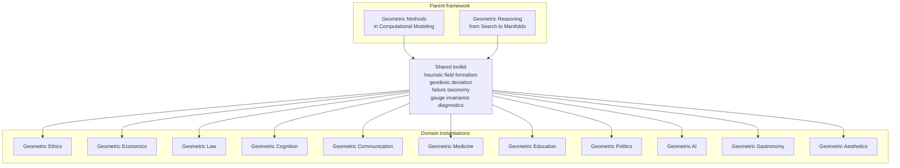

# Geometric Aesthetics: The Mathematical Structure of Judgment

**Andrew H. Bond**
Senior Member, IEEE · San Jose State University

**Volume 13 of the Geometric Series**

---

## Thesis

Aesthetic judgment has geometric structure that a single scalar ("a 4-star book", "a beautiful song") cannot represent. Aesthetic evaluation is not a point on a line — it is a location in a space with dimensions, distances, directions, regimes, and curvature. When we flatten this structure into a scalar we lose information, and the information we lose is precisely the information that matters most in hard cases: which qualities are present, where uncertainty concentrates, how judgments change across genres and regimes, and where the rules discontinuously change.

## Status

- **Book manuscript:** complete first draft. 30 chapters + 6 appendices, ~6,000 lines of markdown. Live at [erisml.org/geometric-aesthetics](https://erisml.org/geometric-aesthetics/).
- **IEEE paper:** [`paper/v3.pdf`](paper/v3.pdf) — *Beauty as Preference Optimization on Perceptual Eigenspaces* (pre-registered, empirically validated, submitted).
- **Next steps:** human-subjects extension beyond text (see Appendix C), additional case studies (Appendix D).

## Repository layout

```
geometric-aesthetics/
├── README.md              ← this file
├── OUTLINE.md             ← 6-part book plan
├── LICENSE                ← MIT (matches series)
├── build_book.py          ← pandoc → HTML build pipeline
├── book/
│   ├── README.md          ← source/authoring conventions
│   └── src/
│       ├── _BOOK_REFERENCE.md
│       ├── chapter-01..30-*.md     ← 30 chapters
│       └── appendices/
│           └── appendix-a..f-*.md  ← 6 appendices
├── paper/
│   ├── v3.tex / v3.pdf    ← IEEE-style manuscript (current)
│   └── v1, v2              ← version history
├── figures/               ← 5 SVG illustrations
└── docs/                  ← proofreader tooling + build log
```

## The series



## The Geometric Series

| Book | Status |
|------|--------|
| [Geometric Methods](https://github.com/ahb-sjsu/agi-hpc) | Published |
| [Geometric Reasoning](https://github.com/ahb-sjsu/geometric-reasoning) | Draft complete |
| [Geometric Ethics](https://github.com/ahb-sjsu/erisml-lib) | Published (v1.23) |
| [Geometric Economics](https://github.com/ahb-sjsu/geometric-economics) | Draft |
| [Geometric Law](https://github.com/ahb-sjsu/geometric-law) | Draft |
| [Geometric Cognition](https://github.com/ahb-sjsu/geometric-cognition) | Draft |
| [Geometric Communication](https://github.com/ahb-sjsu/geometric-communication) | Draft |
| [Geometric Medicine](https://github.com/ahb-sjsu/geometric-medicine) | Draft |
| [Geometric Education](https://github.com/ahb-sjsu/geometric-education) | Draft |
| [Geometric Politics](https://github.com/ahb-sjsu/geometric-politics) | Draft |
| [Geometric AI](https://github.com/ahb-sjsu/geometric-ai) | Draft |
| [Geometric Gastronomy](https://github.com/ahb-sjsu/geometric-gastronomy) | Draft |
| **Geometric Aesthetics: The Mathematical Structure of Judgment** | **Book draft complete (Vol 13)** |

## Reading order

1. **Paper** — [`paper/v3.pdf`](paper/v3.pdf), ~15 pages. The mathematical core in one sitting.
2. **Book outline** — [`OUTLINE.md`](OUTLINE.md). 6 parts, 30 chapters, 6 appendices.
3. **Book chapters** — `book/src/`. Full prose manuscript.
4. **Web edition** — [erisml.org/geometric-aesthetics/](https://erisml.org/geometric-aesthetics/) for a rendered read-through.

## Building

HTML rendering uses [`build_book.py`](build_book.py):

```bash
python build_book.py                             # default: ../erisml-lib/docs/geometric-aesthetics/
AESTHETICS_OUT_DIR=/tmp/out python build_book.py  # override
```

Requires `pandoc` 3.x on PATH. See [`book/README.md`](book/README.md) for authoring conventions.

## License

MIT. See [LICENSE](LICENSE).

## Citation

```bibtex
@book{bond2026aesthetics,
  author    = {Bond, Andrew H.},
  title     = {Geometric Aesthetics: The Mathematical Structure of Judgment},
  publisher = {Manuscript in preparation},
  year      = {2026},
  note      = {Volume 13 of the Geometric Series.
               Paper form: IEEE-style manuscript, \url{paper/v3.pdf}}
}

@article{bond2026aesthetics-paper,
  author  = {Bond, Andrew H.},
  title   = {Geometric Aesthetics: Beauty as Preference Optimization
             on Perceptual Eigenspaces},
  journal = {IEEE Transactions on Cognitive and Developmental Systems},
  year    = {2026},
  note    = {Submitted}
}
```
