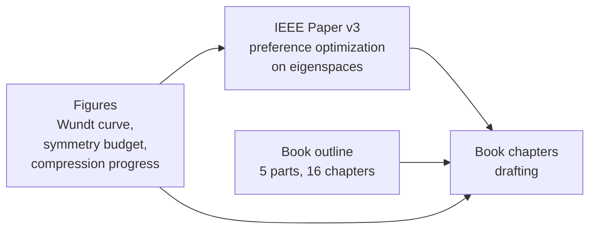
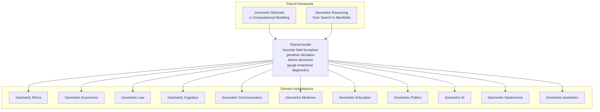

# Geometric Aesthetics: The Mathematical Structure of Beauty Across Domains

**Andrew H. Bond**
Senior Member, IEEE | San Jose State University

---

## Part of the Geometric Series

This book is a domain instantiation of the general framework developed in:

- **Geometric Methods in Computational Modeling** (Bond, 2026a) — the mathematical toolkit
- **Geometric Reasoning: From Search to Manifolds** (Bond, 2026c) — the parent theory

It inherits the heuristic field formalism, geodesic deviation measure, failure taxonomy, gauge invariance diagnostics, and engineering toolkit from the parent text, and instantiates them on perceptual-preference manifolds.

## Thesis

Aesthetic experience — the perception of beauty, harmony, elegance, and balance — has geometric structure that is remarkably consistent across sensory modalities, artistic disciplines, and even abstract domains like mathematics and law. This book develops a unified geometric theory of aesthetics grounded in three principles:

1. **Symmetry with controlled violation** — beauty arises at the boundary between symmetry and asymmetry
2. **Compressibility in the natural basis** — harmony is compression in the perceiver's learned eigenstructure
3. **Compression progress** — aesthetic preference follows geodesics on a learnable manifold that deforms with expertise, culture, and context

## Status

- **Paper (v3):** complete and pre-registered. IEEE-style manuscript at [`paper/v3.pdf`](paper/v3.pdf) ([`v3.tex`](paper/v3.tex)).
- **Book:** chapter plan locked. See [`OUTLINE.md`](OUTLINE.md) — 5 parts, 16 chapters, 3 appendices.
- **Drafting:** Parts I and II stubbed in [`book/`](book/), to be elaborated from the paper's theorems.



## Series map



## The Geometric Series

| Book | Status |
|------|--------|
| [Geometric Methods](https://github.com/ahb-sjsu/agi-hpc) | Published |
| [Geometric Reasoning](https://github.com/ahb-sjsu/geometric-reasoning) | Draft complete |
| [Geometric Ethics](https://github.com/ahb-sjsu/erisml-lib) | Published (v1.23) |
| [Geometric Economics](https://github.com/ahb-sjsu/geometric-economics) | Draft |
| [Geometric Law](https://github.com/ahb-sjsu/geometric-law) | Draft |
| [Geometric Cognition](https://github.com/ahb-sjsu/geometric-cognition) | Outline |
| [Geometric Communication](https://github.com/ahb-sjsu/geometric-communication) | Outline |
| [Geometric Medicine](https://github.com/ahb-sjsu/geometric-medicine) | Outline |
| [Geometric Education](https://github.com/ahb-sjsu/geometric-education) | Outline |
| [Geometric Politics](https://github.com/ahb-sjsu/geometric-politics) | Outline |
| [Geometric AI](https://github.com/ahb-sjsu/geometric-ai) | Outline |
| [Geometric Gastronomy](https://github.com/ahb-sjsu/geometric-gastronomy) | Outline |
| [Geometric Gastronomy](https://github.com/ahb-sjsu/geometric-gastronomy) | Outline |
| **Geometric Aesthetics: Beauty as Preference Optimization on Perceptual Eigenspaces** | **Paper complete, book drafting (Vol 13)** |

## Repository layout

```
geometric-aesthetics/
├── README.md               ← this file
├── OUTLINE.md              ← full 5-part / 16-chapter plan
├── paper/                  ← IEEE-style manuscript (v1 → v3)
├── book/                   ← chapter drafts (stubbed from the outline)
├── figures/                ← SVG illustrations for the book + paper
├── docs/                   ← supplementary notes
└── .github/workflows/      ← CI (LaTeX build)
```

## Reading order

1. Start with the **paper** (`paper/v3.pdf`, ~15 pages) for the complete mathematical core in one sitting.
2. Then [`OUTLINE.md`](OUTLINE.md) for the book-length scope.
3. Then individual chapters in [`book/`](book/) as they get drafted from the paper's theorems.

## License

MIT (matching the rest of the Geometric Series). See [LICENSE](LICENSE).

## Citation

If you reference this work, please cite the IEEE paper:

```bibtex
@article{bond2026aesthetics,
  author  = {Bond, Andrew H.},
  title   = {Geometric Aesthetics: Beauty as Preference Optimization on Perceptual Eigenspaces},
  journal = {IEEE Transactions on Cognitive and Developmental Systems},
  year    = {2026},
  note    = {Submitted}
}
```
